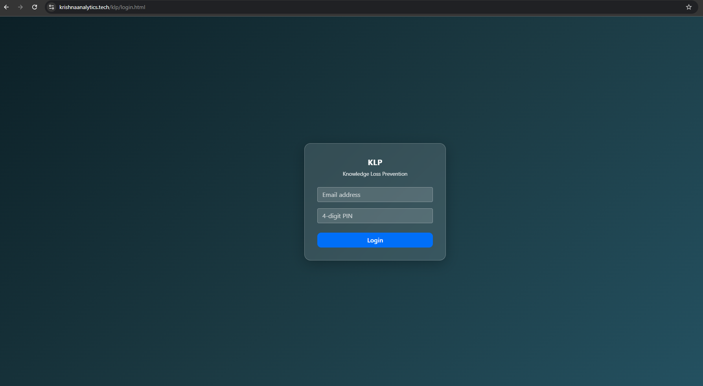
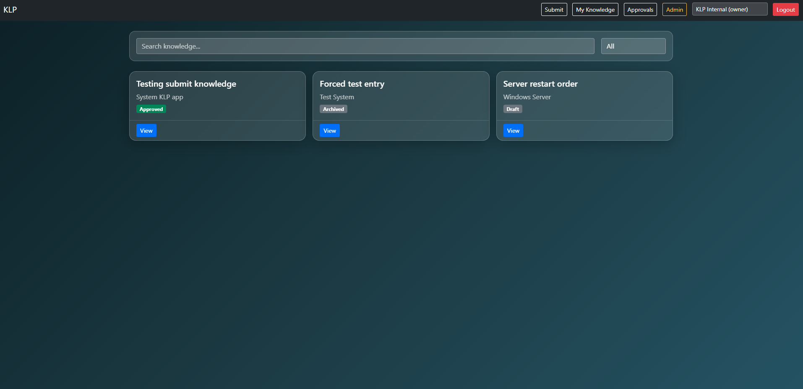
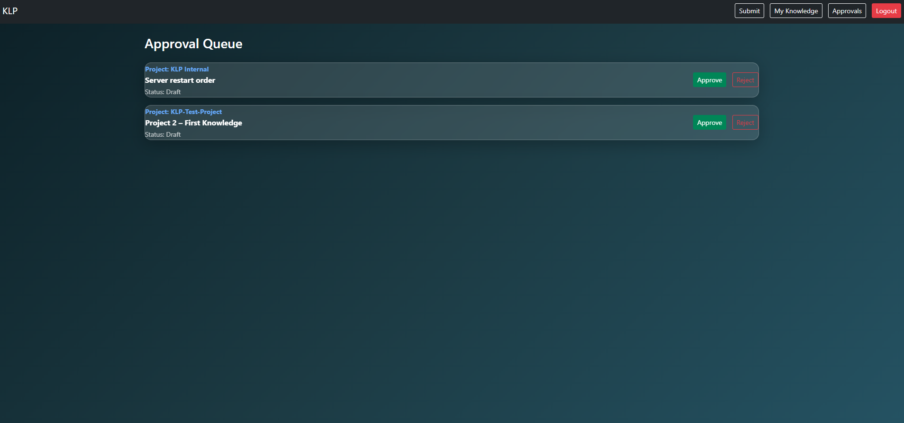

# Knowledge Loss Prevention (KLP) Platform

An internal web platform designed to capture, review, and retain critical operational knowledge across projects, reducing dependency on individuals and preventing knowledge loss.

## 🚀 Live Demo
🔗 https://your-live-url  
*(Demo access available on request)*

## ✨ Features
- Email + PIN authentication
- Project-based access control
- Role-based permissions (Owner / Member)
- Knowledge submission and approval workflow
- Admin-managed users, projects, and memberships
- Glassmorphism UI with responsive design

## 🧱 Architecture
- Frontend: HTML, JavaScript, Bootstrap
- Backend: Cloudflare Workers
- Database: Cloudflare D1 (SQLite)
- Hosting: Cloudflare Pages

## 📸 Screenshots

## 🛠️ Why this project
Built to model real-world internal enterprise tools such as knowledge bases and approval systems, focusing on simplicity, security, and maintainability rather than social-style engagement features.
