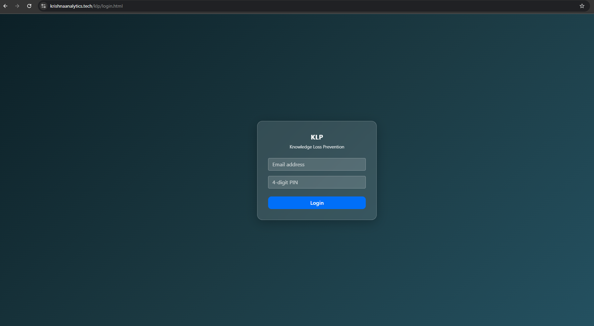
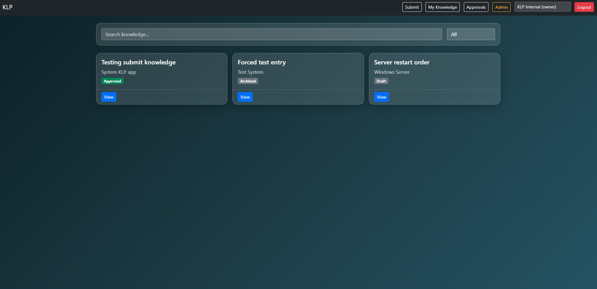
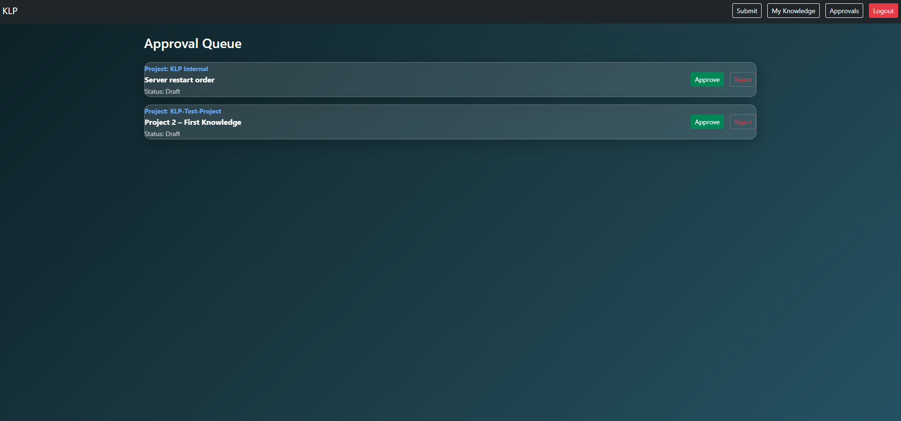

# Knowledge Loss Prevention (KLP) Platform

An internal web platform designed to capture, review, and retain critical operational knowledge across projects, reducing dependency on individuals and preventing knowledge loss.

## 🚀 Live Demo
🔗 [KLP](https://krishnaanalytics.tech/klp/login.html)
*(Demo access available on request)*

## ▶️ Run locally (zero setup)

```bash
npm start          # or: node demo/server.js
```

Then open **http://localhost:3000** and log in with any demo account (PIN `1234`):

| Email | Role |
|---|---|
| `owner@klp.test` | Owner of both projects (sees Admin + Approval queue) |
| `member@klp.test` | Member of *KLP-Test-Project* |

The `demo/` server serves the static frontend **and** a mock implementation of the
Cloudflare Worker API (`/api/*`) with in-memory seed data, so the whole workflow can
be exercised without deploying anything. Data resets on server restart.
**Demo server is for local development only — never deploy it.**

## ✨ Features
- Email + PIN authentication (Enter-key submit, inline validation, loading states)
- Project-based access control with project switcher
- Role-based permissions (Owner / Member)
- Knowledge submission with **Draft → Review → Approved/Rejected** workflow
- Full-text search across title, system, process area and description
- Status filtering: Approved / Pending / Draft / Rejected / Archived
- Detail view with full description, submitter and date
- "My Knowledge" view filtered to the signed-in user's items
- Approval queue with confirm + toast feedback
- Admin-managed users and roles
- XSS-safe rendering, HTML-escaped content everywhere
- Consistent glassmorphism UI with responsive layout, loading skeletons, empty/error states, and toast notifications

## 🧱 Architecture
- Frontend: HTML, JavaScript, Bootstrap — shared design system in `klp.css`, shared app shell & API client in `klp.js`
- Backend: Cloudflare Workers
- Database: Cloudflare D1 (SQLite)
- Hosting: Cloudflare Pages
- Local demo/dev server: `demo/server.js` (Node, zero dependencies, mock API)

### API contract consumed by the frontend
| Endpoint | Method | Purpose |
|---|---|---|
| `/api/login` | POST | Verify email + PIN, start session |
| `/api/me` | GET | Current user + `isOwner` flag |
| `/api/projects` | GET | Projects and the user's role in each |
| `/api/knowledge` | GET / POST | List (project-scoped via `x-project-id`) / create items |
| `/api/knowledge/decision` | POST | `{ id, action: "approve" \| "reject" }` |
| `/api/approvals` | GET | Items awaiting decision (owner view) |
| `/api/admin/users` | POST | Add a user (owner only) |

Auth headers on every request: `x-user-email`, `x-user-pin`, plus `x-project-id` when a
project is selected. Item fields are read defensively (`created_by`/`description`/…),
so the UI degrades gracefully if a field is absent.

## 📸 Screenshots




## 🛠️ Why this project
Built to model real-world internal enterprise tools such as knowledge bases and approval systems, focusing on simplicity, security, and maintainability rather than social-style engagement features.

## 🔭 Possible next steps (backend required)
- Dedicated `GET /knowledge/:id` and `PATCH` endpoints for editing drafts / re-submitting rejected items
- Session tokens instead of sending the PIN with every request
- Server-side pagination + full-text search (FTS5 in D1)
- Audit trail (who approved/rejected what, and when)
